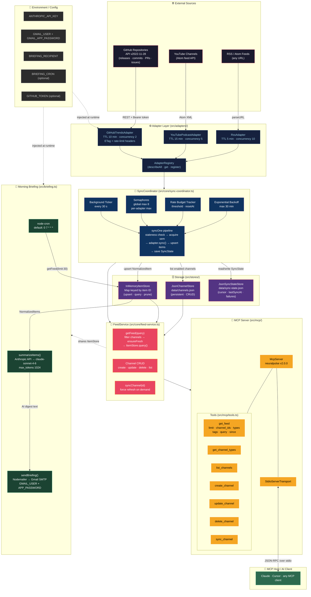

# NeuralPulse MCP — Architecture Diagram

## System Overview



---

## Component Reference

| Layer | Component | Role |
|---|---|---|
| **External** | RSS/Atom, YouTube, GitHub API | Content sources |
| **Adapters** | RssAdapter, YouTubePodcastAdapter, GitHubTrendsAdapter | Normalize raw data → `NormalizedItem` |
| **Registry** | AdapterRegistry | Lookup & introspection |
| **Sync Engine** | SyncCoordinator | Concurrency control, TTL, backoff, rate limits |
| **Storage** | JsonChannelStore, InMemoryItemStore, JsonSyncStateStore | Persist channels & sync state; cache items |
| **Core** | FeedService | Orchestrate CRUD + query pipeline |
| **MCP** | McpServer + 7 Tools | Expose everything over MCP stdio protocol |
| **Briefing** | node-cron + Claude API + Nodemailer | Scheduled daily email digest |

## Data Flow (query path)

```
AI Client
  → MCP tool call (get_feed)
    → FeedService.getFeed()
      → SyncCoordinator.ensureFresh()   ← lazy refresh if stale
        → Adapter.sync()                ← fetch from external source
          → InMemoryItemStore.upsert()
      → InMemoryItemStore.query()       ← filter · sort · limit
    → renderFeedItems()
  ← JSON-RPC response (text)
```

## Data Flow (briefing path)

```
node-cron (07:00)
  → getFeed({ limit: 30 })             ← reads InMemoryItemStore
  → summarizeItems() via Claude API    ← AI narrative digest
  → sendBriefing() via Gmail SMTP      ← email to recipient
```
